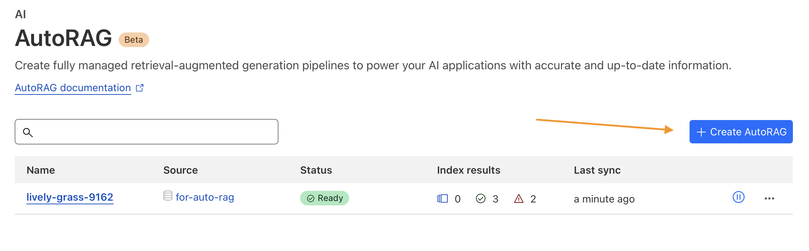
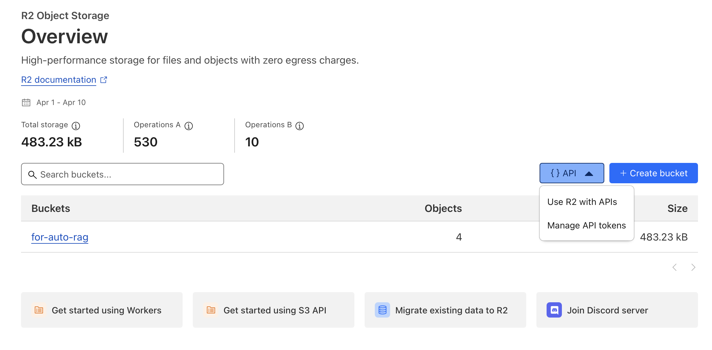
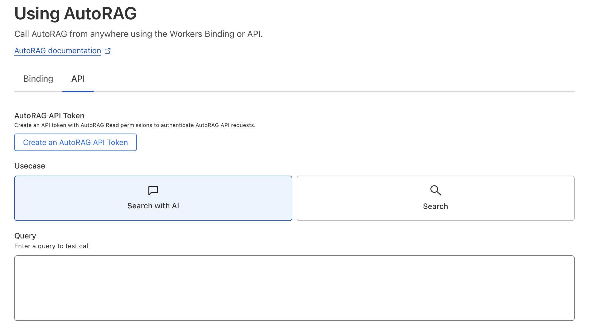

# Rubyrag

Seamlessly integrate Cloudflare AutoRag into your Ruby on Rails applications with this gem. It provides a simple and idiomatic Ruby interface for leveraging AutoRag’s automatic retrieval-augmented generation (RAG) pipeline—making it easy to connect your app’s data with powerful AI models using Cloudflare Workers and Vectorize.

## Installation


```bash
bundle add rubyrag
```

If bundler is not being used to manage dependencies, install the gem by executing:

```bash
gem install rubyrag
```

## Usage

Setup Cloudflare Autorag

Get API keys for R2
 
Get API keys for AI

Setup rubyrag
```ruby
client = Rubyrag.new(provider: :cloudflare_auto_rag,
                     bucket: "bucket_name",
                     access_key_id: "access_key_id",
                     secret_access_key: "secret_access_key",
                     r2_endpoint: "http://endpoint.com",
                     autorag_endpoint: "http://endpoint.com",
                     autorag_access_token: "autorag_access_token",)

# Add file to index
client.add(file_path: File.expand_path("file_with_text.txt", __dir__))

# Query the rag
client.query(query: "query")
```

## Development

After checking out the repo, run `bin/setup` to install dependencies. Then, run `rake spec` to run the tests. You can also run `bin/console` for an interactive prompt that will allow you to experiment.

To install this gem onto your local machine, run `bundle exec rake install`. To release a new version, update the version number in `version.rb`, and then run `bundle exec rake release`, which will create a git tag for the version, push git commits and the created tag, and push the `.gem` file to [rubygems.org](https://rubygems.org).

## Contributing

Bug reports and pull requests are welcome on GitHub at https://github.com/[USERNAME]/rubyrag.

## License

The gem is available as open source under the terms of the [MIT License](https://opensource.org/licenses/MIT).

